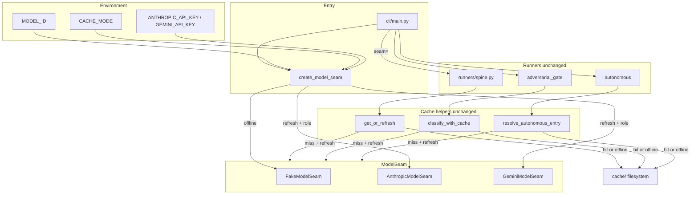

# Implementation Plan: Live Model Seam Wiring

**Branch**: `006-live-model-seam` | **Date**: 2026-07-09 | **Spec**: [spec.md](./spec.md)

**Input**: Feature specification from `/specs/006-live-model-seam/spec.md`

## Summary

Wire live provider adapters behind the existing `ModelSeam` protocol so `CACHE_MODE=refresh` invokes Claude Sonnet 5 (`claude-sonnet-5`) or Gemini 3.5 Flash (`gemini-3.5-flash`) on cache miss, persists responses through unchanged cache helpers (`CacheStore.get_or_refresh`, `classify_with_cache`, `resolve_autonomous_entry`), and replays identically in offline mode. Default and CI remain `FakeModelSeam` + committed cache with zero API keys. Central factory (`create_model_seam`) selects seam from `CACHE_MODE` and `MODEL_ID`; CLI switches from hardcoded `FakeModelSeam()` to factory; runners keep constructor injection unchanged. Credentials: `ANTHROPIC_API_KEY`, `GEMINI_API_KEY`, with deprecated `MODEL_API_KEY` fallback. Acceptance tests mock SDK boundaries — no live keys in merge gate.

## Technical Context

**Language/Version**: Python 3.11  
**Primary Dependencies**: Inherited — `pydantic` v2, `pyyaml`; **new** — `anthropic>=0.49.0,<1`, `google-genai>=1.14.0,<2` (official SDKs, lazy-imported)  
**Storage**: Filesystem — `cache/` (committed entries + operator refresh writes), `export/` (read-only ground truth)  
**Testing**: `pytest`; new acceptance under `tests/core/`; opt-in `tests/live/` with `@pytest.mark.live` excluded from CI; full merge gate `uv run pytest -v` offline  
**Target Platform**: Linux/macOS/Windows dev; GitHub Actions CI (offline, no API key)  
**Project Type**: Library-style Python package + CLI + committed cache replay  
**Performance Goals**: Full offline pytest suite completes in existing CI budget (<5 min); single refresh adjudication bounded by adapter timeout (default 120s)  
**Constraints**: No Postgres; frozen `export/` and committed `cache/` untouched by implementation; `CACHE_MODE=offline` default; N=5 samples unchanged; no provider strings in runners/CLI; Sonnet 5 / Gemini 3.5 sampling param restrictions honored  
**Scale/Scope**: 2 live model roles; 1 factory; 2 adapter modules; CLI wiring only (5 subcommands); 3 existing cache refresh paths reused

## Constitution Check

*GATE: Must pass before Phase 0 research. Re-check after Phase 1 design.*

| Principle | Result | Evidence |
|-----------|--------|----------|
| **I. Deterministic Ground Truth** | **PASS** | Adapters return verdicts only; scoring still reads export `expected`; no live agent or Postgres |
| **II. Acceptance-Spec Before Implementation** | **PASS** | Spec acceptance scenarios defined; plan sequences failing factory/adapter tests before implementation ([contracts/](./contracts/)) |
| **III. Frozen-Interface / Frozen-Export Discipline** | **PASS** | Additive `core/model/*` modules + CLI factory call; no edits to `export/`, committed `cache/`, or runner orchestration |
| **IV. Reproducibility and Offline Verification** | **PASS** | `uv` + `uv.lock`; default offline; CI `CACHE_MODE=offline`, no secrets; committed cache replay unchanged |
| **V. Vocabulary and Wording Discipline** | **PASS** | No new reader-facing tier naming; internal T1–T3 unchanged |
| **VI. Currency Before Communication** | **PASS** | Model ids web-verified 2026-07-09 in [research.md](./research.md) with doc URLs |
| **VII. Git Flow and Human Merge Gate** | **PASS** | Branch `006-live-model-seam`; PR + human merge; CI green prerequisite |
| **VIII. Dependency and Cost Discipline** | **PASS** (justified) | Two SDK deps in Complexity Tracking; bounded tool rounds; refresh operator-driven not full-matrix CI |
| **IX. Tracked Artifacts, Not Ephemeral Chat** | **PASS** | spec/plan/research/data-model/contracts/quickstart under `specs/006-live-model-seam/` |
| **X. Stop and Surface Over Silent Choices** | **PASS** | Research resolves SDK choice, role registry, credential policy, `primary` refresh rejection; no NEEDS CLARIFICATION |

*Post-design re-check (2026-07-09): **PASS** — SDK additions justified; no gate violations.*

## Scope Guardrails

- **No frozen export / committed cache edits** — regeneration operator-driven via refresh only (FR-012).
- **No runner orchestration changes** — seam injected at CLI boundary; tests inject `FakeModelSeam` directly.
- **No cache helper changes** — `get_or_refresh`, `classify_with_cache`, `resolve_autonomous_entry` frozen from Feature 001–004.
- **No live keys in CI** — adapter tests mock SDK clients; `@pytest.mark.live` excluded from workflow.
- **No multi-model parallel sweeps** — out of scope v1.
- **Live provider refresh excluded from merge gate** — operator `CACHE_MODE=refresh` with API keys is local-only (documented in [quickstart.md](./quickstart.md)). CI runs `@pytest.mark.refresh` simulation tests with `FakeModelSeam` (offline, no keys). `@pytest.mark.live` excluded via `pyproject.toml` `addopts = "-m 'not live'"`.

## Test-First Sequencing

Constitution Principle II requires acceptance tests before implementation. Phase 2 `tasks.md` (via `/speckit-tasks`) MUST sequence:

| Phase | Tests first (MUST FAIL) | Then implement |
|-------|-------------------------|----------------|
| Role registry | `test_acceptance_model_factory.py` (known roles, pinned ids) | `core/model/roles.py` |
| Credential policy | `test_acceptance_provider_credentials.py` (precedence, deprecation, missing key) | `core/model/credentials.py` |
| Factory offline | `test_acceptance_model_factory.py` (offline → FakeModelSeam always) | `core/model/factory.py` |
| Factory refresh guards | same (unknown role, primary in refresh, missing credential before network) | `create_model_seam()` |
| Anthropic adapter contract | `test_acceptance_live_adapters.py` (mocked client, adjudicate + classify) | `core/model/anthropic_adapter.py` |
| Gemini adapter contract | same (mocked client) | `core/model/gemini_adapter.py` |
| Autonomous tool loop | same (mocked tools → `AdjudicationSessionResult`) | adapter tool-round loop |
| CLI wiring | `tests/cli/test_acceptance_cli.py` (factory used; offline unchanged) | `cli/main.py` |
| Env example | config test or lint of `.env.example` | `.env.example` update |
| Regression | existing full suite | no changes to 001–005 modules |

**Definition of done**: SC-001 — `uv run pytest -v` green offline with zero API keys; SC-002 — operator can follow quickstart refresh for each live role locally.

## Project Structure

### Documentation (this feature)

```text
specs/006-live-model-seam/
├── plan.md              # This file
├── research.md
├── data-model.md
├── quickstart.md
├── contracts/
│   ├── model-seam-factory.md
│   └── live-adapters.md
├── checklists/
│   └── requirements.md
└── tasks.md             # Phase 2 (/speckit-tasks — not created by /speckit-plan)
```

### Source Code (repository root)

```text
core/model/
├── seam.py                  # ModelSeam protocol + load_model_config (unchanged surface)
├── fake.py                  # FakeModelSeam (unchanged)
├── roles.py                 # NEW — ModelRoleDescriptor registry
├── credentials.py           # NEW — resolve_provider_api_key
├── factory.py               # NEW — create_model_seam
├── anthropic_adapter.py     # NEW — AnthropicModelSeam
├── gemini_adapter.py        # NEW — GeminiModelSeam
└── __init__.py              # export factory + adapters

core/cache/store.py          # unchanged — get_or_refresh
runners/adversarial_gate/cache.py   # unchanged — classify_with_cache
runners/autonomous/cache.py         # unchanged — resolve_autonomous_entry
runners/*.py                 # unchanged — seam injection
cli/main.py                  # MODIFY — create_model_seam() instead of FakeModelSeam()

.env.example                 # MODIFY — provider keys + deprecation note

tests/core/
├── test_acceptance_model_factory.py       # NEW
├── test_acceptance_live_adapters.py       # NEW
├── test_acceptance_provider_credentials.py # NEW
└── test_acceptance_model_seam.py          # unchanged (FakeModelSeam contract)

tests/live/                  # NEW — opt-in live smoke (@pytest.mark.live)
tests/runners/test_acceptance_cache_refresh.py  # unchanged (FakeModelSeam refresh)
tests/cli/test_acceptance_cli.py           # extend factory/offline assertions

cache/                       # unchanged committed entries
export/                      # unchanged frozen export
```

**Structure Decision**: Single-package layout at repo root (no `src/`). Feature 006 adds modules under existing `core/model/` and minimal CLI diff — consistent with Features 001–005.

## Complexity Tracking

| Violation | Why Needed | Simpler Alternative Rejected Because |
|-----------|------------|-------------------------------------|
| +2 runtime deps (`anthropic`, `google-genai`) | Official SDKs for GA Sonnet 5 / Gemini 3.5 Flash tool-use, auth, and provider-specific thinking params | Raw `httpx` duplicates tool-session loops and breaks on provider API migrations (documented Sonnet 5 sampling/thinking changes) |
| Live adapter modules (2 providers) | Spec FR-001/FR-002 require two target models behind one protocol | Single generic HTTP client cannot parse divergent tool/response schemas without becoming a third framework |

## Phase 0 & Phase 1 Outputs

| Artifact | Path | Status |
|----------|------|--------|
| Research (model ids, SDK, factory policy) | [research.md](./research.md) | Complete |
| Data model | [data-model.md](./data-model.md) | Complete |
| Factory contract | [contracts/model-seam-factory.md](./contracts/model-seam-factory.md) | Complete |
| Live adapters contract | [contracts/live-adapters.md](./contracts/live-adapters.md) | Complete |
| Quickstart | [quickstart.md](./quickstart.md) | Complete |
| Tasks | [tasks.md](./tasks.md) | Complete |

## Refresh Path Architecture



## Pinned Model Identifiers (verified 2026-07-09)

| Harness role | Provider API model id | Source |
|--------------|----------------------|--------|
| `claude-sonnet-5` | `claude-sonnet-5` | Anthropic Models overview |
| `gemini-3.5-flash` | `gemini-3.5-flash` | Google AI Gemini 3.5 Flash GA docs |

Legacy committed-cache role `primary` remains offline-only; refresh with `MODEL_ID=primary` fails before network.

## Next Step

Run `/speckit-implement` to execute dependency-ordered tasks in [tasks.md](./tasks.md).
