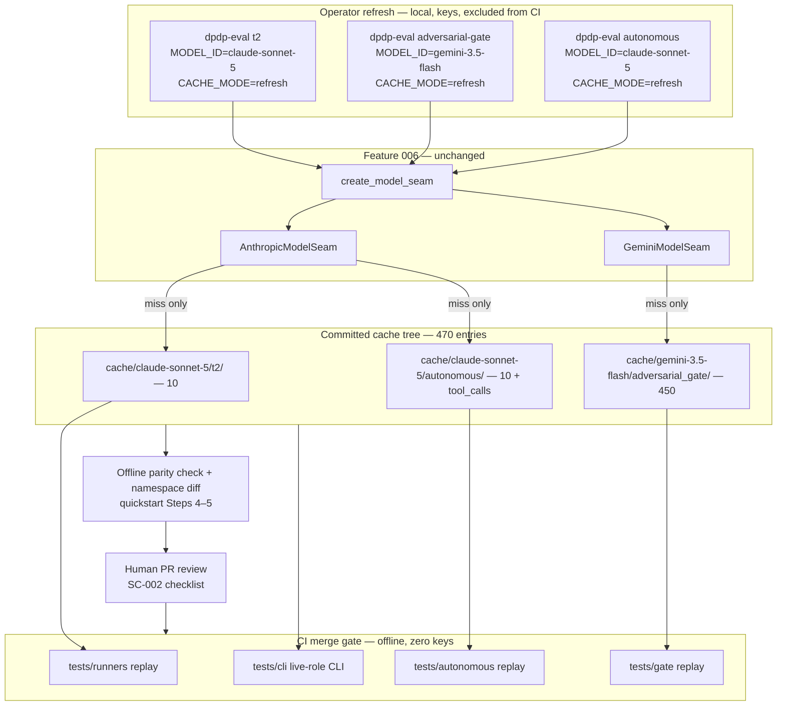

# Implementation Plan: Live Role Cache Seeding

**Branch**: `007-live-role-cache-seed` | **Date**: 2026-07-12 | **Spec**: [spec.md](./spec.md)

**Input**: Feature specification from `/specs/007-live-role-cache-seed/spec.md`

## Summary

Complete Feature 006 SC-002 by seeding and committing the full live-role cache set —
`cache/claude-sonnet-5/{t2,autonomous}/` (10 + 10 entries) and
`cache/gemini-3.5-flash/adversarial_gate/` (450 entries) — using Feature 006 refresh
infrastructure **unchanged** (`create_model_seam`, live adapters, `CACHE_MODE=refresh`,
existing cache helpers). No new runtime code: deliverables are (1) an operator refresh
runbook with cost estimates and an SC-002 completion checklist in [quickstart.md](./quickstart.md),
(2) the committed cache tree per [contracts/committed-cache-tree.md](./contracts/committed-cache-tree.md),
(3) keyless offline replay acceptance tests in `tests/runners`, `tests/gate`,
`tests/autonomous`, and `tests/cli` per [contracts/offline-replay-tests.md](./contracts/offline-replay-tests.md),
and (4) a README on-ramp for live-role evaluations. `cache/primary/` and `export/` are
untouched; CI stays fully offline with zero provider keys.

## Technical Context

**Language/Version**: Python 3.11

**Primary Dependencies**: None added. Existing: `pydantic` v2, `pyyaml`, `anthropic`,
`google-genai` (Feature 006, already in `uv.lock`)

**Storage**: Filesystem — `cache/` gains two committed live-role namespaces (470 JSON files);
`export/` read-only ground truth, unchanged

**Testing**: `pytest`; 4 new offline replay acceptance files (one per suite:
`tests/runners`, `tests/gate`, `tests/autonomous`, `tests/cli`); default merge gate
`uv run pytest -v` offline, no keys; no new markers

**Target Platform**: Linux/macOS/Windows dev; GitHub Actions CI (offline). Operator refresh:
local machine with provider billing (PowerShell and Bash runbooks)

**Project Type**: Committed data artifacts + acceptance tests + operator docs over an
existing library/CLI harness

**Performance Goals**: All three offline replay paths complete in <5 min on a clean clone
post-`uv sync` (SC-004); CI suite stays within existing budget

**Constraints**: `cache/primary/` and `export/` diff-empty on this branch; entries generated
only via Feature 006 refresh path (no handcrafting); refresh excluded from merge gate;
gate refresh bounded at 450 classifications, autonomous at 10 sessions × ≤10 tool rounds;
total seed spend ≈ $3–6 (ceiling < $10, verified pricing 2026-07-12 in [research.md](./research.md) R3)

**Scale/Scope**: 2 live roles × 3 runner-path bindings; 470 committed cache entries;
4 test files; quickstart + README updates; zero runtime code changes (adapter bugfixes only
if refresh exposes a 006 contract violation — see [research.md](./research.md) R9)

## Constitution Check

*GATE: Must pass before Phase 0 research. Re-check after Phase 1 design.*

| Principle | Result | Evidence |
|-----------|--------|----------|
| **I. Deterministic Ground Truth** | **PASS** | Cache entries hold model verdicts/classifications only; scoring still grades against export `expected`; no live agent or Postgres |
| **II. Acceptance-Spec Before Implementation** | **PASS** | Replay test contract written ([contracts/offline-replay-tests.md](./contracts/offline-replay-tests.md)); tests must fail on missing/short cache before entries are committed — sequencing binds `/speckit-tasks` |
| **III. Frozen-Interface / Frozen-Export** | **PASS** | Purely additive: new namespaces, new tests, docs; `cache/primary/`, `export/`, runners, adapters, helpers unchanged; reviewer verifies `git diff main -- cache/primary export` empty |
| **IV. Reproducibility and Offline Verification** | **PASS** | No dependency changes (`uv.lock` untouched); replay tests keyless in merge gate; refresh operator-local only (FR-011) |
| **V. Vocabulary** | **PASS** | Internal `t2`/`adversarial_gate`/`autonomous` ids in cache paths and tests; README uses reader-facing names (records-augmented, adversarial-gate, autonomous retrieval); no retired terms |
| **VI. Currency** | **PASS** | Model ids re-verified and pricing verified 2026-07-12 with sources in [research.md](./research.md) R3/R9 |
| **VII. Git Flow and Human Merge Gate** | **PASS** | Branch `007-live-role-cache-seed`; PR + human merge; committed entries require operator refresh + human diff review (FR-015) |
| **VIII. Dependency and Cost Discipline** | **PASS** | Zero new dependencies; run matrix fixed at 470 entries matching primary parity; spend ≈ $3–6 vs tens-of-dollars ceiling; gate volume (450 calls) explicitly budgeted |
| **IX. Tracked Artifacts** | **PASS** | plan/research/data-model/contracts/quickstart under `specs/007-live-role-cache-seed/`; cache entries themselves are committed artifacts |
| **X. Stop and Surface** | **PASS** | Clarification session 2026-07-12 resolved commit scope, gate parity, T2/autonomous parity; checklist ambiguities (CHK002/004/007/020/022 et al.) resolved in research with cited decisions |

*Post-design re-check (2026-07-12): **PASS** — no new dependencies, no frozen-surface edits, no unresolved clarifications.*

## Scope Guardrails

- **No runtime code changes** — factory, adapters, credentials, cache helpers, runners, CLI
  all reused as shipped in 006. Bugfix boundary defined in research R9.
- **No `cache/primary/` or `export/` changes** — diff-scope invariant enforced by quickstart
  Step 5 and reviewer checklist.
- **Only three namespace/runner combinations** — no `gemini-3.5-flash/t2/`, no T1/T3 live
  seeding, no cross-combinations.
- **Refresh never in CI** — merge gate remains `-m "not live"`, offline, keyless; new tests
  are plain offline tests with no new markers.
- **No handcrafted cache entries** — provenance rule in
  [contracts/committed-cache-tree.md](./contracts/committed-cache-tree.md).

## Test-First Sequencing

Constitution Principle II. Phase 2 `tasks.md` (via `/speckit-tasks`) MUST sequence:

| Order | Tests first (MUST FAIL initially) | Then deliver |
|-------|-----------------------------------|--------------|
| 1 | `tests/runners/test_acceptance_live_role_t2_replay.py` — fails with `CacheMissError` (namespace absent) | Operator seeds `cache/claude-sonnet-5/t2/` via runbook Step 1 |
| 2 | `tests/gate/test_acceptance_live_role_gate_replay.py` — fails on empty namespace | Operator seeds `cache/gemini-3.5-flash/adversarial_gate/` via Step 2 |
| 3 | `tests/autonomous/test_acceptance_live_role_autonomous_replay.py` — fails on empty namespace | Operator seeds `cache/claude-sonnet-5/autonomous/` via Step 3 |
| 4 | `tests/cli/test_acceptance_cli_live_roles.py` — fails until all namespaces seeded | Offline parity + namespace verification (Steps 4–5) |
| 5 | — | README live-role section + quickstart link (FR-012) |
| 6 | Full regression `uv run pytest -v` offline, keys unset | SC-002/SC-003 sign-off via quickstart checklist |

Note on ordering: test files land on the branch before cache entries are committed (they
fail for the right reason — cache miss); the operator seeding steps are implementation.
Human review of the cache diff (FR-015) happens at PR review, gated by the SC-002 checklist
in [quickstart.md](./quickstart.md).

**Definition of done**: SC-001–SC-005 — 470 committed entries at full parity; merge gate
green offline with zero keys; primary/export untouched; README + quickstart on-ramp complete.

## Project Structure

### Documentation (this feature)

```text
specs/007-live-role-cache-seed/
├── plan.md              # This file
├── research.md          # Phase 0 — coverage counts, refresh shape, cost, checklist resolutions
├── data-model.md        # Phase 1 — namespace/entry/workflow entities (no new runtime types)
├── quickstart.md        # Phase 1 — offline validation + operator runbook + SC-002 checklist
├── contracts/
│   ├── committed-cache-tree.md
│   └── offline-replay-tests.md
├── checklists/
│   ├── requirements.md
│   └── cache-seeding.md
└── tasks.md             # Phase 2 (/speckit-tasks — not created by /speckit-plan)
```

### Source Code (repository root)

```text
cache/
├── primary/                          # FROZEN — no changes
├── claude-sonnet-5/                  # NEW — committed entries (operator-generated)
│   ├── t2/                           #   10 entries: 2 subjects × samples 0–4
│   └── autonomous/                   #   10 entries with tool_calls traces
└── gemini-3.5-flash/                 # NEW — committed entries (operator-generated)
    └── adversarial_gate/             #   450 entries: 90 slice cases × samples 0–4

tests/
├── runners/test_acceptance_live_role_t2_replay.py          # NEW
├── gate/test_acceptance_live_role_gate_replay.py           # NEW
├── autonomous/test_acceptance_live_role_autonomous_replay.py  # NEW
└── cli/test_acceptance_cli_live_roles.py                   # NEW

README.md                             # MODIFY — live-role evaluation on-ramp + 007 quickstart link

core/ runners/ cli/ export/           # UNCHANGED — Feature 006 seam reused as-is
pyproject.toml uv.lock .github/       # UNCHANGED — no deps, no CI config changes
```

**Structure Decision**: Single-package layout at repo root, unchanged from Features 001–006.
Feature 007 adds committed data under `cache/`, one test file per existing suite directory,
and documentation only.

## Complexity Tracking

No constitution violations. No new dependencies, no new abstractions, no runtime code.
(Committed-data volume — 470 JSON files — is bounded by explicit primary-parity requirement
FR-003/004/005 and is not a complexity exception.)

## Phase 0 & Phase 1 Outputs

| Artifact | Path | Status |
|----------|------|--------|
| Research (coverage, refresh shape, cost, checklist resolutions) | [research.md](./research.md) | Complete |
| Data model | [data-model.md](./data-model.md) | Complete |
| Committed cache tree contract | [contracts/committed-cache-tree.md](./contracts/committed-cache-tree.md) | Complete |
| Offline replay tests contract | [contracts/offline-replay-tests.md](./contracts/offline-replay-tests.md) | Complete |
| Quickstart (runbook + SC-002 checklist) | [quickstart.md](./quickstart.md) | Complete |
| Tasks | tasks.md | Pending `/speckit-tasks` |

## Seeding and Replay Flow



## Role/Runner Bindings (fixed)

| Runner path | `MODEL_ID` | Credential (refresh only) | Committed entries |
|-------------|-----------|---------------------------|-------------------|
| T2 tier sweep | `claude-sonnet-5` | `ANTHROPIC_API_KEY` | 10 |
| Adversarial gate | `gemini-3.5-flash` | `GEMINI_API_KEY` | 450 |
| Autonomous | `claude-sonnet-5` | `ANTHROPIC_API_KEY` | 10 |

## Next Step

Run `/speckit-tasks` to generate dependency-ordered tasks (test-first per the sequencing
table above), then `/speckit-implement`.
